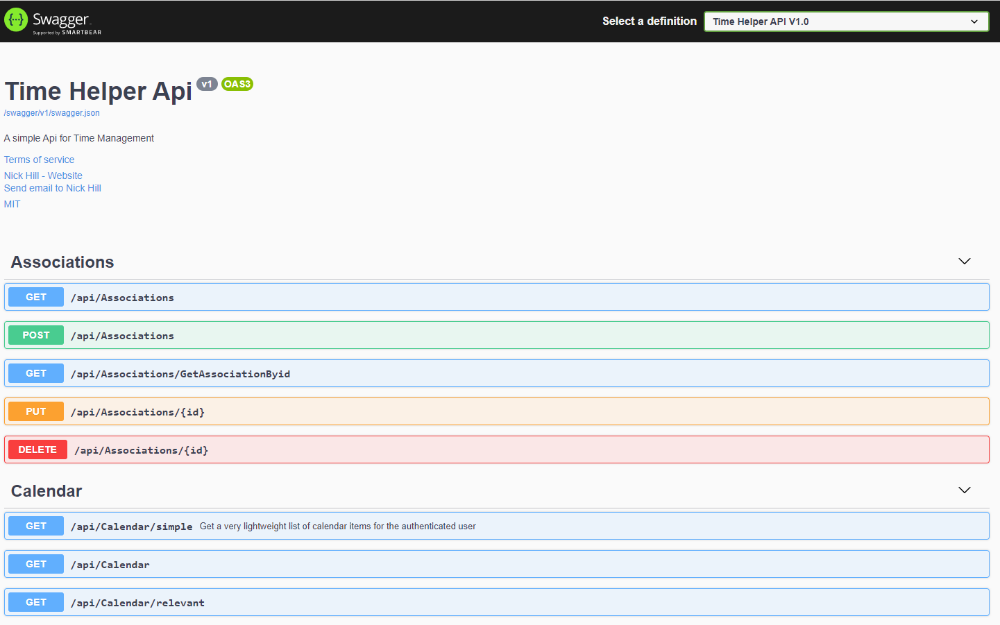
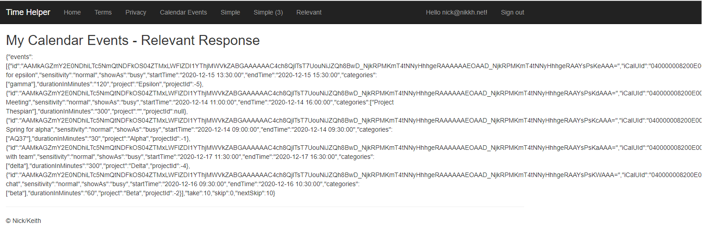
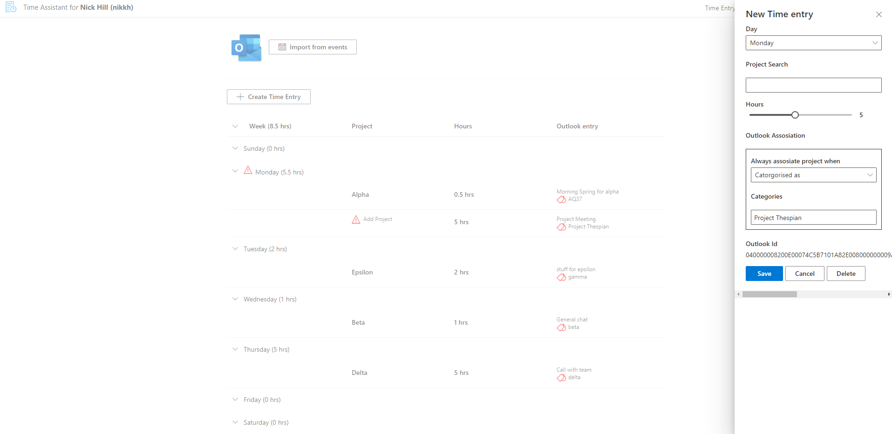

  

# About TimeHelper

TimeHelper is project that explores the possibility of building a quite sophisticated Time Tracking system based on the users entries in their Microsoft Outlook calendar.  The key components of the project are:

1. Azure Active Directory - which controls user consent and (if consent is given) access to the users calendar data
1. TimeHelper-Api - an api which abstracts the complex authentication and authorization interactions from client applications
1. TimeHelper-Client - a native react.js application that enables users to manage and submit their timesheets
1. TimeHelper-Web - is a utility web site that provides support for testing authenitaction and authorization and simple tests for the api.

> Feel free to just read this site, but if you want to deploy, the best thing its to [fork this repo](https://docs.github.com/en/free-pro-team@latest/github/getting-started-with-github/fork-a-repo). Once forked, go to your copy.  Click on actions.  If you are asked click on “I Understand my workflows, go ahead and enable them”. You may need to correct a few things (such as the badges above). 

Time helper is hosted on Azure, and can be deployed automatically (with a single click) using GitHub actions.

Given the permissions and processes for Azure Active Directory (AAD) configuration many vary significantly acorss organisations, AAD configuration must be completed manually before running the GitHub action that creates the hosting infrastructure and deploys the application components.

## AAD Configuration

You dont need to be a global administrator to complete this configuration, but you will need to be a member of the Application administrator role.

AAD configuration should be carried out very carefully.  If you have problems installing and running TimeHelper, it's most likely because of an error configuring AAD.  There are three elements to the AAD configuration required:

- Configure a service principal to allow GitHub actions to create resources in your Azure Subscription
- Configure an AAD application to represent client applications that will access the api component
- Configure an AAD application to represent the api component

These elements are described in detail in the following sections:

### Service Principal for GitHub Actions
The actions in this repo create all the resources necessary to run the TimeHelper application in a new resource group in one of your subscription.  In order to do that we need Azure credentials with contributor rights to the subscription where you will host. Run the following command in Azure CLI and copy the resultant json output to your clipboard

`az ad sp create-for-rbac --name "myApp" --role contributor --scopes /subscriptions/{subscription-id} --sdk-auth`

Then create GitHub secret called AZURE_CREDENTIALS and paste the json content generated above into the value field for the secret. [see here for more details](https://github.com/Azure/login#configure-deployment-credentials)

### Api AAD Application
The Api AAD Application represents the identity of the api applications in the TimeHelper solution.  This application holds delegated permisions to access the [Microsoft Graph Api](https://docs.microsoft.com/en-us/graph/use-the-api).  This means that in order for the Api application to read graph information, such as calendar entries, from the Graph Api, the user needs to consent to the Api application accessing the information on their behalf.

The application also exposes permissions.  The client AAD Application (below) will be authorised to use the Api AAD Application and therefore only authenticated and authorized client applications can use this Api.

For instructions see [Configuring the Api AAD Application](docs/configure_api_app.md).

### Client AAD Application
The Client AAD Application represents the identity of the client applications in the TimeHelper solution.  Configuration in these applications points to this AAD application which is then used to represent the client applications in scenarios for authentication, consent and authorization.

The client application holds valid parameters for authentication.  For example, when the user logs into a client application, the authentication occurs at Azure AD, but this application holds a list of valid 'reply urls' (where the resultant token is returned).  If a url is not in the valid list, authentication will fail.  This prevents unauthorized or spoof applications form obtaining a token.

The client application has permissions to use the Api Application, so clients need to assume the identity of this application before that can access the Api (and consequently the Microsoft Graph to read (for example) calendar information.

For instructions see [Configuring the Client AAD Application](docs/configure_client_app.md).

## Preparing to Deploy

Once you have completed your AAD configuration, then we need to store some parameters relating to tht set-up in your GitHub account.  Sensitive data will be stored in GitHub secrets to ensure they are kept private, and are masked in deployment logs, etc. Please see the [GitHub documentation for more information on managing secrets](https://docs.github.com/en/free-pro-team@latest/actions/reference/encrypted-secrets).  We noted the data items we need to store in secrets as we did our AAD configuration: you'll need those notes now.

Configure GitHub secrets as described in the [Configure GitHub Secrets](docs/configure-github-secrets.md).

## Deploying
It's now time to deploy your application.  This is the fun part - you'll get to go and get a coffee!.

Click on actions.  You should see something similar to this:

1. Click on 'Build TimeHelper Infrastructure'
1. Towards the right of the screen choose 'Run Workflow'
1. On the pop-up screen that appears configure your deployment:

Fill out the parameters as follows:

- location can be any valid azure location (e.g. uksouth, ukwest, northeurope)
- instance name is just a tag that makes it easier to find your resources, you can choose anything you like
- pending delete wont do anything for you - set it to false
- The most important value is 'Application alias'.  This is used to prefix Azure resource names (including storage accounts) so choose a prefix which is around 5 characters alphanumeric (something like nick1).

> Click 'Run Workflow'

You can follow the deployment progress by clicking on the workflow name. When the job as completed, (hopefully icons are all green) then click on 'Job Summary'.  

Make a note of the two reply urls in the log for the job summary and [add the newly generated reply urls to AAD Applications](docs/add-reply-urls.md).

## What was deployed?

If your application deployed sucessfully, then a number of Azure resources have been created.  [Learn more about these resources](docs/resources-deployed.md).

** Note above link needs to be authored **

## Running your application

It's time to test your application.  There are three main elements to test.  

| Component | Description | Url Format | What you should see |
| ----------- | ----------- | ----------- | ----------- |
| Api | The Api that accesses calendar data via the graph api | https://<application_alias>-api.azurewebsites.net | Swagger Api documentation |
| Web | Test Harness to test authentication and view calendar data | https://<application_alias>-web.azurewebsites.net | Bootstrap format web page |
| Client | The client that lets you manage your timesheets based on your calendar | https://<application_alias>-client.azurewebsites.net | Rich Internet Application |

The actual urls to use are recorded in the job summary (see above).

### Testing the API

Open the Api url as specified in the job summary.  The Api is documented using Swagger allows you to execture the API operations, but becasue the authentication and authorisation is complex to configure it best to use the web application.  YOu can still read the swagger doumentation and envisage how you could enhance the API.

### Testing the Web Application
Open the Web url as specified in the job summary.  

### Testing the Client Application
Open the Client url as specified in the job summary.  

