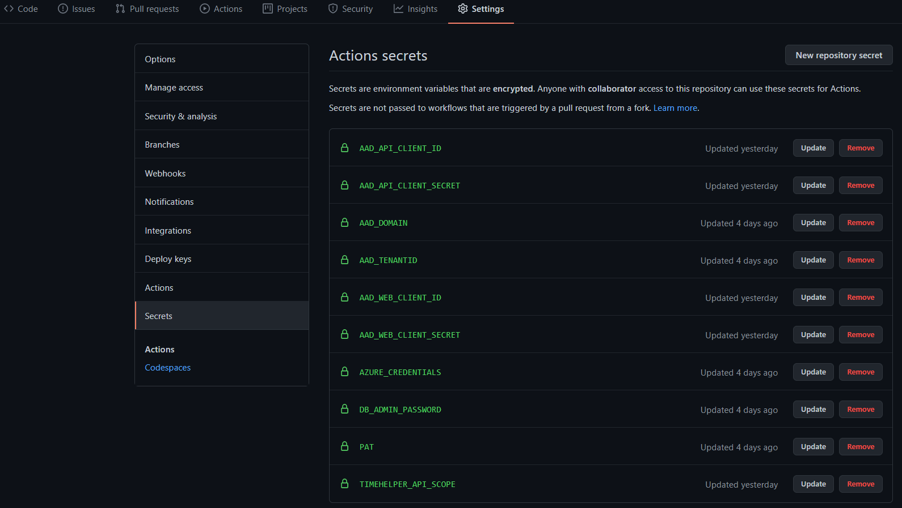

# Configure GitHub Secrets

## AAD_WEB_CLIENT_ID (from AAD configuration)
This is the client (application id) of the Client AAD Application configured earlier.  This id will be propogated by the GitHub actions into the configuration for the TimeHelper-Web and TimeHelper-Client Azure App services.

## AAD_WEB_CLIENT_SECRET (from AAD configuration)
This is the client secret the Client AAD Application configured earlier.  This id will be propogated by the GitHub actions into the configuration for the TimeHelper-Web and is the 'password' that allows the Web Application to assume the identity of the Client AAD application (without a secret any application could spoof this and access the Api).

## AAD_API_CLIENT_ID (from AAD configuration)
This is the client (application id) of the Api AAD Application configured earlier.  This id will be propogated by the GitHub actions into the configuration for the TimeHelper-Api  Azure App service.

## AAD_API_CLIENT_SECRET (from AAD configuration)
This is the client secret the Api AAD Application configured earlier.  This id will be propogated by the GitHub actions into the configuration for the TimeHelper-Api and is the 'password' that allows the Api Application to assume the identity of the Api AAD application (without a secret any application could spoof this and access the Graph Api, providing it had valid user token and that user had consented to Api application accessing graph data on their behalf).

## AAD_DOMAIN
This is the domain of the AAD tenant that you will be using. it is likely to be your company domain or something like <yourdomain>.onmicrosoft.com. You can specify any valid domain associated with your tenant.  Valid domains can be found by [clicking on the Custom domain names](https://portal.azure.com/#blade/Microsoft_AAD_IAM/ActiveDirectoryMenuBlade/Domains) blade in your AAD definition in the Azure portal.

## AAD_TENANTID (from AAD configuration)
This is the tenantid of the AAD tenant that you will be using. This can be found by [on the overview page](https://portal.azure.com/#blade/Microsoft_AAD_IAM/ActiveDirectoryMenuBlade/Domains) for your AAD definition in the Azure portal.

## AZURE_CREDENTIALS
This is the full json output generated from the [service principal for github actions](https://github.com/nikkh/timehelper/blob/main/README.md#service-principal-for-github-actions) section.

## DB_ADMIN_PASSWORD
The deployment created an Azure SQL Database and populates it with sample data.  This secret is used to set the admin password for your SQL DB.  The DB_ADMIN_USER is defined in the [Infrastructure Deployment Workflow file](https://github.com/nikkh/timehelper/blob/main/.github/workflows/infrastructure.yml).  The default value for that is dbadminuser, but can be overriden in the workflow if you wish.

## PAT
This is a Personal Access Token to allow the GitHub actions to access your repo.  This is needed to enable the main infrastructure deployment workflow to kick off deployments of the applications once it has completed normally.  Follow the instructions for [creating a GitHub PAT](https://docs.github.com/en/free-pro-team@latest/github/authenticating-to-github/creating-a-personal-access-token#:~:text=Creating%20a%20token.%201%20Verify%20your%20email%20address%2C,able%20to%20see%20the%20token%20again.%20More%20items) and then store the value of the generated PAT as a secret.

> I dont think you actually need this.  I think instead you can directly reference ${{ secrets.GITHUB_TOKEN }} but I didn't have time to test it yet.

## TIMEHELPER_API_SCOPE (from AAD configuration)
This is the scope exposed by our API application.  Our client will need to specify it on caling the API.  The client applications as part of this solution recall this value from configuration, so by adding it to a GitHub secret we can make the correct value available in our application configurations as part of the automated deployments.
