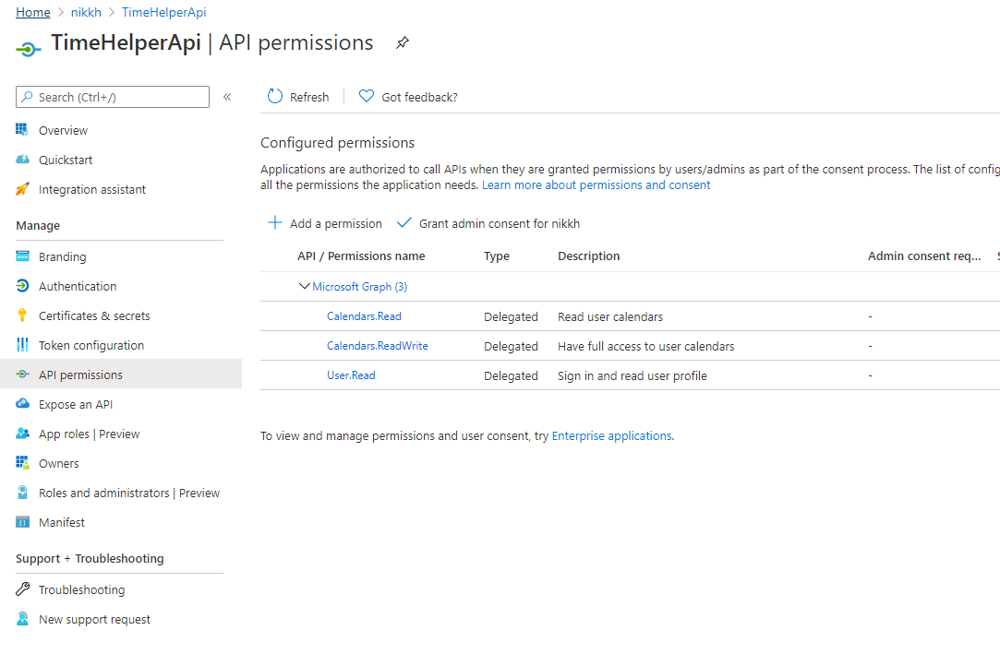

# Configure Azure AD Api Application

The Api AAD Application is a standard Azure AD application Registration.  You can see your registrations in the [Azure portal](https://portal.azure.com/#blade/Microsoft_AAD_IAM/ActiveDirectoryMenuBlade/RegisteredApps). If you have more than one directory, then make sure you switch to the tenant that you want to use for your TimeHelper application. 

## Creating the basic application

Choose the '+ new registration' button at the top of the screen.

1. Choose a name for this application.  (TimeHelperApi would work)
1. Choose 'Accounts in this organizational directory only'.  There's no reason why the other options wouldnt work - but I havent tested them.
1. Choose 'Register'

This has created a shell application without much detail.  We'll fill in the detail shortly, but for now make a note of some items.  We're going to save some deta in GitHub secrets, so I'll use the secret names here to make it easier:

>AAD_API_CLIENT_ID = Application (client) ID

>AAD_TENANTID = Directory (tenant) ID

## Creating a secret

Next we need to generate a secret.  Choose 'Certificates & secrets' from the left nav. Under 'Client secrets' click '+ New client secret'.  Give it a name (main would work), and leave expiry at 1 year.  Click 'Add'. You will see that a new secret value is generated an made available to copy in the value column.  Copy the value (if you navigate away before copying, yo'll need to repeat the process).

>AAD_API_CLIENT_SECRET = the value you just copied

## Requesting Permissions

Our api application will need to access the Microsoft Graph to retrieve calendar entries, so we need to request permissions to do so.  

1. In the left nav, click 'API Permissions'
1. User.Read should be defaulted. dont worry about that for now.
1. Click '+ Add a permission'
1. In the 'Request API Permissions' window that opens choose 'Microsoft Graph'
1. Choose 'Delegated permissions'.  This means that the api application itself cannot access the users data via the graph api, but if the user consents to this, and valid user credentials are presented to the api application, then the api application will be able to access data *for that user only*.
1. Open the 'Calendars' group (you may need to scroll).
1. Choose Calendard.Read and Calendars.ReadWrite (TimeHelper doesnt use the latter, but you could amend it so it writes notes into the calendar, and then it would need this).
1. Click 'Add permissions'

You're Api permissions should look like this:

## Expose an Api

The Api permissions were private to our Api Application.  Now we need to expose an Api for our clients to use (if they are auhtorised).  

1. In the left nav, click 'Expose an API'
1. In the centre of the screen click '+ Add a scope'
1. On the 'Add a scope' screen that opens, leave the deefault generated value and click 'save and continue'
1. The screen morphs into something else
1. In the 'Scope name' box type 'access_as_user'
1. Change 'Who can consent?' to 'Admins and users'
1. In each of the consent display name and description boxes (4) type 'Access Calendar'
1. Click 'Add scope'

> TIMEHELPER_API_SCOPE = 'Application ID Uri' (from the top of the screen above)

That's the Api Application defined.  We will come back to it later, but we need to configure a value that we dont yet know, so we'll come back when we do.

