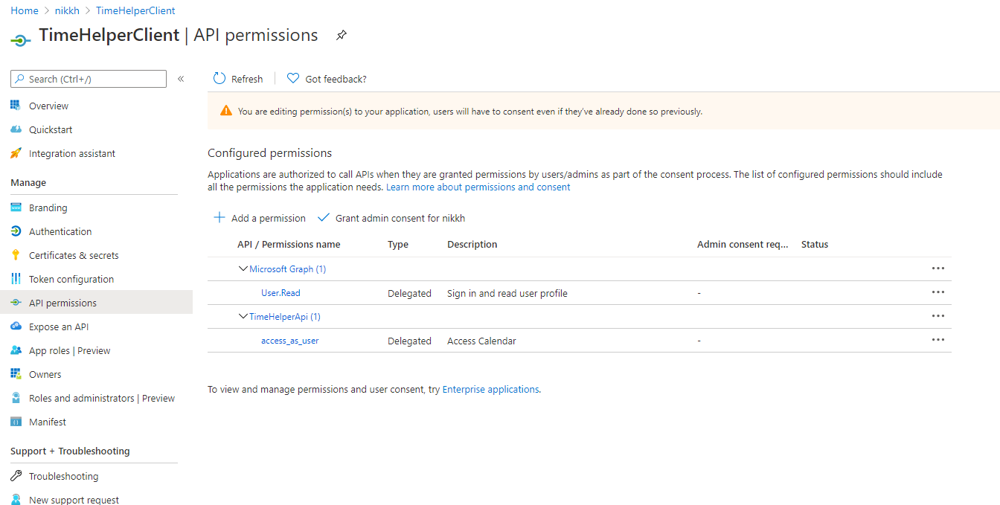
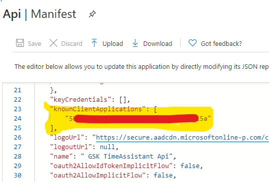

# Configure Azure AD Client Application

The Client AAD Application represents the identity of the client applications in the TimeHelper solution. Configuration in these applications points to this AAD application which is then used to represent the client applications in scenarios for authentication, consent and authorization. You can see your registrations in the [Azure portal](https://portal.azure.com/#blade/Microsoft_AAD_IAM/ActiveDirectoryMenuBlade/RegisteredApps). If you have more than one directory, then make sure you switch to the tenant that you want to use for your TimeHelper application. 

## Creating the basic application

Choose the '+ new registration' button at the top of the screen.

1. Choose a name for this application.  (TimeHelperClient would work)
1. Choose 'Accounts in this organizational directory only'.  There's no reason why the other options wouldnt work - but I havent tested them.
1. Choose 'Register'

This has created a shell application without much detail.  We'll fill in the detail shortly, but for now make a note of some items.  We're going to save some deta in GitHub secrets, so I'll use the secret names here to make it easier:

>AAD_WEB_CLIENT_ID = Application (client) ID

## Creating a secret

Next we need to generate a secret.  Choose 'Certificates & secrets' from the left nav. Under 'Client secrets' click '+ New client secret'.  Give it a name (main would work), and leave expiry at 1 year.  Click 'Add'. You will see that a new secret value is generated an made available to copy in the value column.  Copy the value (if you navigate away before copying, yo'll need to repeat the process).

>AAD_WEB_CLIENT_SECRET = the value you just copied

## Requesting Permissions

Our client application will need to access our Api application (which in turn will use the Microsoft Graph to retrieve calendar entries), so we need to request permissions access our Api application.  

1. In the left nav, click 'API Permissions'
1. User.Read should be defaulted. dont worry about that for now.
1. Click '+ Add a permission'
1. In the 'Request API Permissions' window that opens choose 'My APIs'
1. From the resultant list, choose the API application you created in the previous step (I suggested you call it TimeHelperApi).
1. Again the screen will morph.  Chose the access_As_user permission and choose 'Add permission'

You're Api permissions should look like this:

## Tell our Api Application about our client

We can now go back and provide some information we didn't know when we created our Api Application.  That's the Client Id of the client application that will be using it. (This knowledge allows the Microsoft Authentication Libraries (used in the TimeHelper solution) to know what permissions our Api Requires.  This enables our client app to request permisisons from the user on behalf of the Api App.

1. Navigate back to our [App registrations](https://portal.azure.com/#blade/Microsoft_AAD_IAM/ActiveDirectoryMenuBlade/RegisteredApps)
1. Choose TimeHelperApi (or whatever you called it)
1. From the left nav, choose manifest
1. A json document opens
1. Look at your notes for the client id of our Client App.  We noted it above against the variable *AAD_WEB_CLIENT_ID*.
1. Add your client id to the 'known applications' array and click 'Save':

``"knownClientApplications": [
		"5bd2e2d9-7ef1-xxx-xxx-xxx"
	],``

That's the Client Application defined.  [Continue with prepare to deploy ](https://github.com/nikkh/timehelper#preparing-to-deploy).
